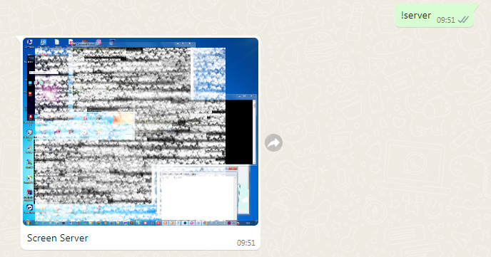

# auto-screen-dekstop-services
## Description
 - Service auto screen monitoring.
 - Untuk memonitor server services dalam bantuk tangkapan layar screen dekstop.
 - Ini bisa dikombinasikan dengan auto service yang lain, seperti Whatsapp api, dll.
 - Terdiri dari 2 format bahasa yaitu : PHP dan NodeJS.
 - Pilih saja salah satu, mau pakai PHP atau NodeJS.

## Instruction PHP
1. Jalankan file `schedule_bath.cmd`
2. Tersimpan dalam format (.png)
3. Timeout service 30 detik

## Instruction NodeJS
1. npm install `npm i node-cron` dan `npm i screenshot-desktop`
2. clone download source git ini.
3. Run script : `npm start`
4. Tersimpan dalam format (.jpg) difolder `media`
5. Timeout cronjob service 10 detik

## Example
Contoh dikombinasikan dengan dengan Whatsapp API untuk monitoring server

